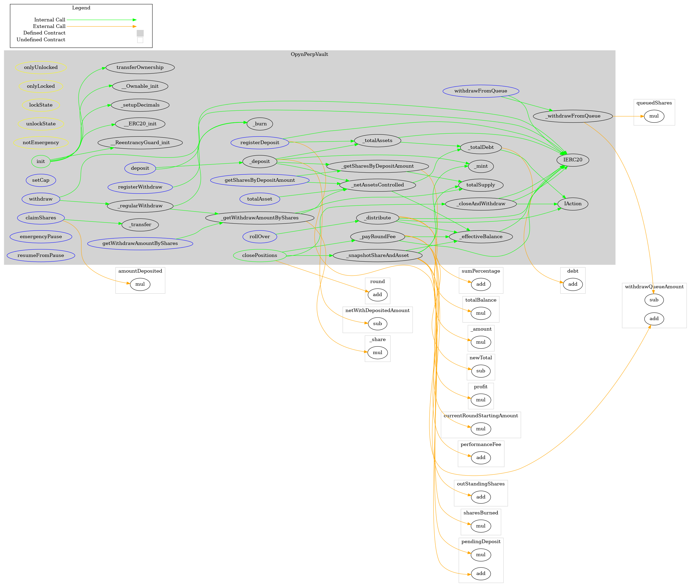
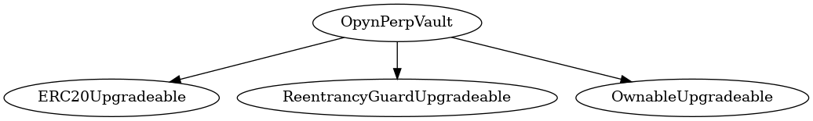
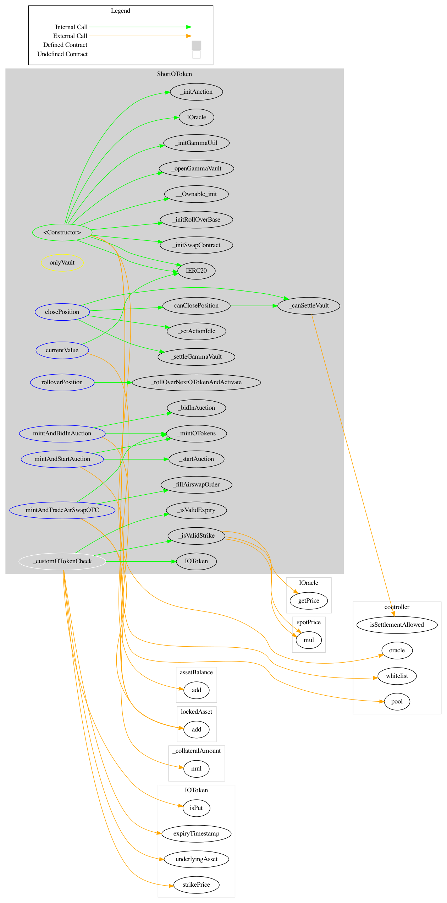
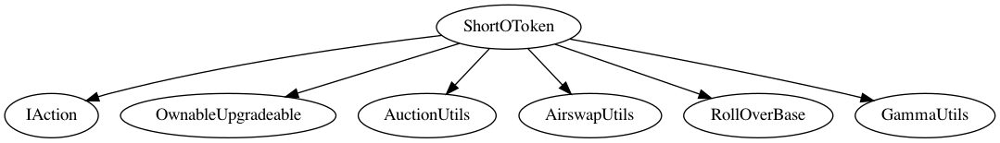
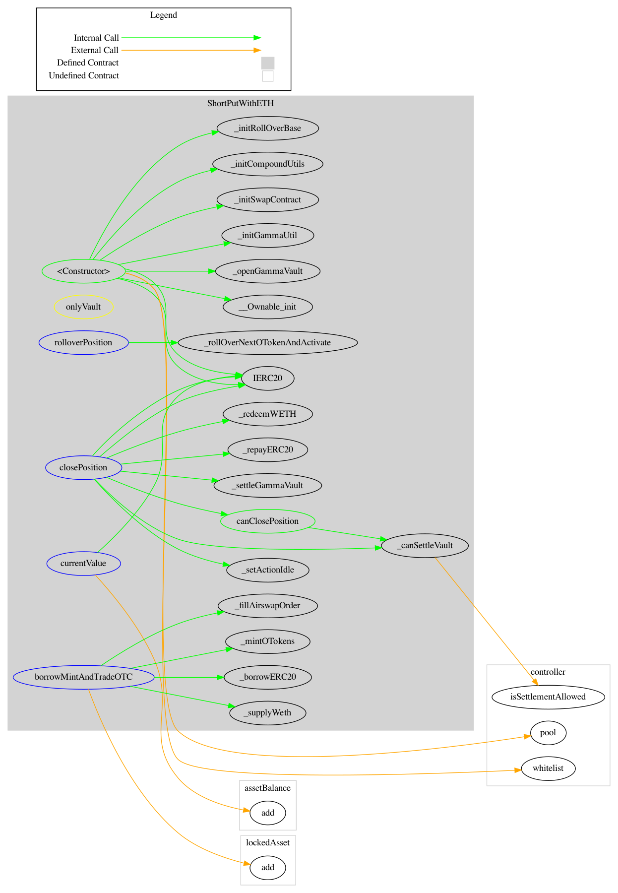
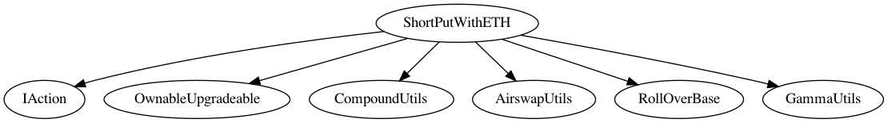

<div id="splash">
    <div id="project">
          <span class="splash-title">
               Project
          </span>
          <br />
          <span id="project-value">
               Project name
          </span>
    </div>
     <div id="details">
          <div id="left">
               <span class="splash-title">
                    Client
               </span>
               <br />
               <span class="details-value">
                    Client name
               </span>
               <br />
               <span class="splash-title">
                    Date
               </span>
               <br />
               <span class="details-value">
                    July 2021
               </span>
          </div>
          <div id="right">
               <span class="splash-title">
                    Reviewers
               </span>
               <br />
               <span class="details-value">
                    Daniel Luca
               </span><br />
               <span class="contact">@cleanunicorn</span>
               <br />
               <span class="details-value">
                    Andrei Simion
               </span><br />
               <span class="contact">@andreiashu</span>
          </div>
    </div>
</div>


## Table of Contents
 - [Details](#details)
 - [Issues Summary](#issues-summary)
 - [Executive summary](#executive-summary)
 - [Scope](#scope)
 - [Recommendations](#recommendations)
     - [Remove upgradability](#remove-upgradability)
     - [Simplify overall architecture](#simplify-overall-architecture)
     - [Make the interaction with Actions more explicit and less reliant on actions reverting](#make-the-interaction-with-actions-more-explicit-and-less-reliant-on-actions-reverting)
     - [Consider removing storage changes in modifiers](#consider-removing-storage-changes-in-modifiers)
     - [Use the Checks-Effects-Interactions Pattern](#use-the-checks-effects-interactions-pattern)
     - [Increase the number of tests](#increase-the-number-of-tests)
 - [Issues](#issues)
     - [Registering a deposit uses the incorrect initial value for the user](#registering-a-deposit-uses-the-incorrect-initial-value-for-the-user)
     - [A Vault owner can allocate 100% of tokens to one action](#a-vault-owner-can-allocate-100-of-tokens-to-one-action)
     - [withdrawFromQueue emits the wrong number of tokens withdrawn](#withdrawfromqueue-emits-the-wrong-number-of-tokens-withdrawn)
     - [claimShares should send tokens only if there something to transfer](#claimshares-should-send-tokens-only-if-there-something-to-transfer)
     - [Depositing should allow up to or equal to the cap](#depositing-should-allow-up-to-or-equal-to-the-cap)
     - [Prefer using uint256 instead of a type with less than 256 bits](#prefer-using-uint256-instead-of-a-type-with-less-than-256-bits)
     - [Cache the length of actions when looping over them](#cache-the-length-of-actions-when-looping-over-them)
     - [Improve gas costs by reducing the use of state variables when possible](#improve-gas-costs-by-reducing-the-use-of-state-variables-when-possible)
     - [OpynPerpVault.onlyLocked() documentation update](#opynperpvaultonlylocked-documentation-update)
     - [IAction.rolloverPosition and IAction.closePosition are not always called together as part round lifecycle](#iactionrolloverposition-and-iactioncloseposition-are-not-always-called-together-as-part-round-lifecycle)
 - [Artifacts](#artifacts)
     - [Surya](#surya)
     - [Coverage](#coverage)
     - [Tests](#tests)
 - [License](#license)


## Details

- **Client** Client name
- **Date** July 2021
- **Lead reviewer** Daniel Luca ([@cleanunicorn](https://twitter.com/cleanunicorn))
- **Reviewers** Daniel Luca ([@cleanunicorn](https://twitter.com/cleanunicorn)), Andrei Simion ([@andreiashu](https://twitter.com/andreiashu))
- **Repository**: [Project name](https://github.com/opynfinance/perp-vault-templates)
- **Commit hash** `1248e6606feb3279a94104df6c6dfcb8d46271f4`
- **Technologies**
  - Solidity
  - Typescript

## Issues Summary

| SEVERITY       |    OPEN    |    CLOSED    |
|----------------|:----------:|:------------:|
|  Informational  |  1  |  0  |
|  Minor  |  4  |  0  |
|  Medium  |  4  |  0  |
|  Major  |  1  |  0  |

## Executive summary

This report represents the results of the engagement with **Client name** to review **Project name**.

The review was conducted over the course of **2 weeks** from **October 15 to November 15, 2020**. A total of **5 person-days** were spent reviewing the code.

We started the review by going through the provided [documentation](https://opyn.gitbook.io/perp-vault/) and the source code.

On Monday we set up a meeting with the client to discuss the project and the current state of the code. We've gone through a few flows, to make sure we understand the overall architecture of the system.

The main purpose of the project is to be an example for developers that want to leverage the Opyn protocol. This is why we consider the project to be simple to understand and provide sufficient functionality to be used in a real-world application.

On Wednesday we set up a new meeting with the client to discuss a few findings and to give access to the issues we've found. We expressed a few concerns regarding to the complexity and reduced readability of the whole system.

We continued to review the code, while remaining in constant communication with the client.

On Friday, at the end of the review, we set up a report delivery meeting where we presented the final report.

## Scope

The initial review focused on the [Project name](https://github.com/opynfinance/perp-vault-templates) repository, identified by the commit hash `1248e6606feb3279a94104df6c6dfcb8d46271f4`.

We focused on manually reviewing the codebase, searching for security issues such as, but not limited to, re-entrancy problems, transaction ordering, block timestamp dependency, exception handling, call stack depth limitation, integer overflow/underflow, self-destructible contracts, unsecured balance, use of origin, costly gas patterns, architectural problems, code readability.

**Includes:**

- code/contracts/core/OpynPerpVault.sol
- code/contracts/example-actions/ShortOToken.sol
- code/contracts/example-actions/ShortPutWithETH.sol
- code/contracts/utils/AuctionUtils.sol
- code/contracts/utils/CompoundUtils.sol
- code/contracts/utils/GammaUtils.sol
- code/contracts/utils/ZeroXUtils.sol
- code/contracts/utils/RollOverBase.sol
- code/contracts/utils/AirswapUtils.sol

Because of the complexity of the codebase and decreased readability, we were unable to perform a complete review. We mostly focused on the core component of the system `OpynPerpVault`, but we also took a look at the other contracts. The actions were mostly considered as "black boxes" and we did not perform a complete review of them. 

Even though the `utils` folder was included in the scope, there was no time to completely review it.

## Recommendations

We identified a few possible general improvements that are not security issues during the review, which will bring value to the developers and the community reviewing and using the product.

### Remove upgradability

Upgradability is a feature that allows a developer to upgrade a contract to a new version without having to redeploy the entire codebase. This also means that the storage is usually handled differently if the contract is upgradeable. It creates more risk when organizing the storage, and more care needs to be put into the design of the storage. Additionally, it poses a risk when upgrading the contract to mess up the storage layout. Because the reviewed system is a template of what developers can do to leverage the Opyn protocol, we believe the added complexity of having upgradability is not worth it.

### Simplify overall architecture

The purpose of this system is to create a simple example that allows devs to understand how to leverage the Opyn protocol. A few methods have deep call stacks, and this doesn't help new developers trying to understand how to use the protocol.

Check the linked [call graph](#call-graph) to see how the methods are called. The deep call stack is a good indicator of a method that needs to be refactored. In some cases, an internal method has only one caller method, and we recommend removing some of them and adding the code directly in the caller body's method.

This will help with readability, reduce internal calls and reduce gas costs.

### Make the interaction with Actions more explicit and less reliant on actions reverting

Anyone can call `closePositions()` to finalize a round. 


[code/contracts/core/OpynPerpVault.sol#L310-L320](https://github.com/monoceros-alpha/review-opyn-perp-vault-templates-2021-07/blob/3d44603300dd9abffe5a1c1e1c2647e9f6b80c7b/code/contracts/core/OpynPerpVault.sol#L310-L320)
```solidity
  /**
   * @notice allows anyone to close out the previous round by calling "closePositions" on all actions.
   * @dev this does the following:
   * 1. calls closePositions on all the actions withdraw the money from all the actions
   * 2. pay all the fees
   * 3. snapshots last round's shares and asset balances
   * 4. empties the pendingDeposits and pulls in those assets to be used in the next round
   * 5. sets aside assets from the main vault into the withdrawQueue
   * 6. ends the old round and unlocks the vault
   */
  function closePositions() public onlyLocked unlockState {
```

When called, the first thing that happens is to call the internal function `_closeAndWithdraw()`.


[code/contracts/core/OpynPerpVault.sol#L321-L322](https://github.com/monoceros-alpha/review-opyn-perp-vault-templates-2021-07/blob/3d44603300dd9abffe5a1c1e1c2647e9f6b80c7b/code/contracts/core/OpynPerpVault.sol#L321-L322)
```solidity
    // calls closePositions on all the actions and transfers the assets back into the vault
    _closeAndWithdraw();
```

The internal method `_closeAndWithdraw()` goes through every action and tries to close each position.


[code/contracts/core/OpynPerpVault.sol#L419-L422](https://github.com/monoceros-alpha/review-opyn-perp-vault-templates-2021-07/blob/3d44603300dd9abffe5a1c1e1c2647e9f6b80c7b/code/contracts/core/OpynPerpVault.sol#L419-L422)
```solidity
  function _closeAndWithdraw() internal {
    for (uint8 i = 0; i < actions.length; i = i + 1) {
      // 1. close position. this should revert if any position is not ready to be closed.
      IAction(actions[i]).closePosition();
```

It expects a revert if the position cannot be closed. This makes the `OpynPerpVault` reliant on the correct implementation of all the actions and their 3rd part systems. If one of the actions was implemented incorrectly or the platform it relies on unexpectedly fails, all of the funds (from all of the actions) are blocked. It is desired to reduce the risk of this happening. 

An approach that strengthens the system as a whole is to allow actions to fail but require them to return `true` if the position can be closed and `false` if the position cannot be closed. This would allow the `OpynPerpVault` to be more independent of the actions. In addition, ideally, when an action fails, the `OpynPerpVault` will have the option of ignoring the action altogether instead of blocking all of the funds. 

This can be achieved by doing an external call and handling the returned values.

An example inspired by [OpenZeppelin's `SafeERC20.safeTransfer`](https://github.com/OpenZeppelin/openzeppelin-contracts/blob/566a774222707e424896c0c390a84dc3c13bdcb2/contracts/token/ERC20/utils/SafeERC20.sol#L25) describes such an approach below.

```solidity
pragma solidity >=0.7.2;

contract UnreliableContract {
    function run(uint n) public pure returns (bool) {
        if (n % 2 == 0) {
            revert("I dislike even numbers");
        }
        
        return true;
    }
}

contract CallExternal {
    event CallResult(bool success, bytes result);
    
    UnreliableContract immutable uc;
    
    constructor() {
        uc = new UnreliableContract();
    }
    
    function callExternal() public {
        // Instead of calling directly like so
        // uc.run(block.number);
        
        // You can use a low level call and handle the failed execution
        
        // Concatenates arguments in a Solidity style
        bytes memory callData = abi.encodeWithSelector(uc.run.selector, block.number);
        
        // Does an external call and returns the result.
        // This type of call does not fail if the external call fails
        (bool success, bytes memory result) = address(uc).call(callData);
        
        // `success` represents if the call failed or not (reverted or not)
        if (success) {
            emit CallResult(true, result);
        } else {
            // `result` has 2 parts:
            // `0x08c379a0` represents the error signature, specifically the first 4 bytes of `keccak256("Error(string)")`
            // The actual abi encoded string "I dislike even numbers"
            emit CallResult(false, result);
        }
    }
}
```

The first contract `UnreliableContract` reverts if even numbers are provided in the `run()` method. The second contract `CallExternal` calls the `run()` method of `UnreliableContract` and handles the failed execution.

A suggestion is to use a similar approach as the one described in the `CallExternal` contract. This would allow the `OpynPerpVault` to be more independent of the actions. All interactions with the actions could (but not necessarily) be considered untrustworthy, and the `OpynPerpVault` should be able to handle the failure of the actions.

### Consider removing storage changes in modifiers

There are 2 cases where modifiers that change state are used.


[code/contracts/core/OpynPerpVault.sol#L310-L320](https://github.com/monoceros-alpha/review-opyn-perp-vault-templates-2021-07/blob/3d44603300dd9abffe5a1c1e1c2647e9f6b80c7b/code/contracts/core/OpynPerpVault.sol#L310-L320)
```solidity
  /**
   * @notice allows anyone to close out the previous round by calling "closePositions" on all actions.
   * @dev this does the following:
   * 1. calls closePositions on all the actions withdraw the money from all the actions
   * 2. pay all the fees
   * 3. snapshots last round's shares and asset balances
   * 4. empties the pendingDeposits and pulls in those assets to be used in the next round
   * 5. sets aside assets from the main vault into the withdrawQueue
   * 6. ends the old round and unlocks the vault
   */
  function closePositions() public onlyLocked unlockState {
```


[code/contracts/core/OpynPerpVault.sol#L333-L336](https://github.com/monoceros-alpha/review-opyn-perp-vault-templates-2021-07/blob/3d44603300dd9abffe5a1c1e1c2647e9f6b80c7b/code/contracts/core/OpynPerpVault.sol#L333-L336)
```solidity
  /**
   * @notice distributes funds to each action and locks the vault
   */
  function rollOver(uint256[] calldata _allocationPercentages) external virtual onlyOwner onlyUnlocked lockState {
```

Usually modifiers are used to limit access (think about `onlyOwner`) and don't change state or emit events. We believe this pattern (of limiting access) is desired because it is more explicit and less error-prone. It also doesn't hide state-changing code within the modifier.

Changing state or having complex logic in the modifier is not incorrect, but it does reduce readability. The amount of generated code is still the same, the modifier's code is effectively "copied" in the contract's bytecode; adding the code from the modifiers (`lockState` and `unlockState`) will not increase/decrease the size of the contract, but it will increase readability.

### Use the Checks-Effects-Interactions Pattern

The [Checks-Effects-Interactions Pattern](https://docs.soliditylang.org/en/develop/security-considerations.html#use-the-checks-effects-interactions-pattern) is a defensive security practice whereby calls to other (external or internal) contracts should be made only after the required checks have been made and any state changes performed.

Note that calls to known contracts might in turn cause calls to unknown contracts, so it is better to just apply this pattern.

We found that the Opyn Perp Vault Templates, follows this recommendation well, apart from the  `_snapshotShareAndAsset` where a call to the `_mint` function is performed before a state change:


[code/contracts/core/OpynPerpVault.sol#L565-L568](https://github.com/monoceros-alpha/review-opyn-perp-vault-templates-2021-07/blob/d94fcb2e2173008272604705a9fc618710349462/code/contracts/core/OpynPerpVault.sol#L565-L568)
```solidity
    uint256 sharesToMint = pendingDeposit.mul(totalShares).div(vaultBalance);
    _mint(address(this), sharesToMint);
    pendingDeposit = 0;
  }
```

In this case, this is not a security issue since `_mint` is part of the `ERC20` contract owned by the system. Nonetheless, our recommendation is to perform the `pendingDeposit` value reset before the call to the `mint` function.

### Increase the number of tests

A good rule of thumb is to have 100% test coverage. This does not guarantee the lack of security problems, but it means that the desired functionality behaves as intended. The negative tests also bring a lot of value because not allowing some actions to happen is part of the desired behavior.

## Issues


### [Registering a deposit uses the incorrect initial value for the user](https://github.com/monoceros-alpha/review-opyn-perp-vault-templates-2021-07/issues/9)
 

**Description**

When the vault is locked, the users can still queue deposits and withdraws. However, they cannot be immediately accessed, so specific accounting needs to be done.

Users call `registerDeposit`:


[code/contracts/core/OpynPerpVault.sol#L245](https://github.com/monoceros-alpha/review-opyn-perp-vault-templates-2021-07/blob/3d44603300dd9abffe5a1c1e1c2647e9f6b80c7b/code/contracts/core/OpynPerpVault.sol#L245)
```solidity
  function registerDeposit(uint256 _amount, address _shareRecipient) external onlyLocked {
```

The funds they wish to deposit are moved into the vault.


[code/contracts/core/OpynPerpVault.sol#L246](https://github.com/monoceros-alpha/review-opyn-perp-vault-templates-2021-07/blob/3d44603300dd9abffe5a1c1e1c2647e9f6b80c7b/code/contracts/core/OpynPerpVault.sol#L246)
```solidity
    IERC20(asset).safeTransferFrom(msg.sender, address(this), _amount);
```

And the accounting needs to be done for this user to be handled later.


[code/contracts/core/OpynPerpVault.sol#L249-L251](https://github.com/monoceros-alpha/review-opyn-perp-vault-templates-2021-07/blob/3d44603300dd9abffe5a1c1e1c2647e9f6b80c7b/code/contracts/core/OpynPerpVault.sol#L249-L251)
```solidity
    userRoundQueuedDepositAmount[_shareRecipient][round] = userRoundQueuedWithdrawShares[_shareRecipient][round].add(
      _amount
    );
```

On top of the initial value of `userRoundQueuedDepositAmount[_shareRecipient][round]`, we need to add the current deposited value of `_amount`.

However, a copy/paste artifact from `registerWithdraw` was left in the code, the initial value used is `userRoundQueuedWithdrawShares[_shareRecipient][round]` instead of `userRoundQueuedDepositAmount[_shareRecipient][round]`.

**Recommendation**

Update the accounting to reflect the correct initial value of the queued deposit.

**Observation**

These kinds of bugs should be caught by the tests. 

The test that checks this functionality being right is located here.


[code/test/unit-tests/core/OpynPerpVault.ts#L318-L338](https://github.com/monoceros-alpha/review-opyn-perp-vault-templates-2021-07/blob/67ce34e00f9c9aa0036573e1c5e144c5f6cffd70/code/test/unit-tests/core/OpynPerpVault.ts#L318-L338)
```
    it("should be able to schedule a deposit with WETH", async () => {
      await weth.connect(depositor6).deposit({ value: depositAmount });
      await weth.connect(depositor6).approve(vault.address, ethers.constants.MaxUint256);

      const totalAssetBefore = await vault.totalAsset();
      const sharesBefore = await vault.balanceOf(depositor6.address);
      const vaultWethBefore = await weth.balanceOf(vault.address);
      const testAmountToGetBefore = await vault.getSharesByDepositAmount(depositAmount);

      await vault.connect(depositor6).registerDeposit(depositAmount, depositor6.address);

      const totalAssetAfter = await vault.totalAsset();
      const sharesAfter = await vault.balanceOf(depositor6.address);
      const vaultWethAfter = await weth.balanceOf(vault.address);
      const testAmountToGetAfter = await vault.getSharesByDepositAmount(depositAmount);

      expect(sharesAfter.eq(sharesBefore), "should not mint shares").to.be.true;
      expect(vaultWethAfter.sub(vaultWethBefore).eq(depositAmount)).to.be.true;
      expect(totalAssetAfter.eq(totalAssetBefore), "should not affect totalAsset").to.be.true;
      expect(testAmountToGetAfter.eq(testAmountToGetBefore)).to.be.true;
    });
```

However, the functionality isn't completely tested. This test only checks going from 0 to `depositAmount`. The broken functionality is related to increasing the deposit amount, which is done by this piece of code (where the bug exists):


[code/contracts/core/OpynPerpVault.sol#L249-L251](https://github.com/monoceros-alpha/review-opyn-perp-vault-templates-2021-07/blob/67ce34e00f9c9aa0036573e1c5e144c5f6cffd70/code/contracts/core/OpynPerpVault.sol#L249-L251)
```solidity
    userRoundQueuedDepositAmount[_shareRecipient][round] = userRoundQueuedWithdrawShares[_shareRecipient][round].add(
      _amount
    );
```

This hints at the way the code was developed. A test-driven development is a good way to have well-tested code, but the tests need to be written before the code is implemented, and the code needs to only satisfy the tests. In this case, there is additional functionality (increasing the deposit size) that doesn't have an associated test.

Not having a specific test for additional functionality, added to the fact that there are tests checking the code, gives a false sense of security about the correctness of the code.


---


### [A Vault owner can allocate 100% of tokens to one action](https://github.com/monoceros-alpha/review-opyn-perp-vault-templates-2021-07/issues/10)
 

**Description**

A Vault owner can call `rollOver` function in order to distribute the funds to the actions. The `_allocationPercentages` argument deals with how much each action should have allocated as a percentage of the available funds in the Vault:


[code/contracts/core/OpynPerpVault.sol#L336-L341](https://github.com/monoceros-alpha/review-opyn-perp-vault-templates-2021-07/blob/d94fcb2e2173008272604705a9fc618710349462/code/contracts/core/OpynPerpVault.sol#L336-L341)
```solidity
  function rollOver(uint256[] calldata _allocationPercentages) external virtual onlyOwner onlyUnlocked lockState {
    require(_allocationPercentages.length == actions.length, "INVALID_INPUT");

    emit Rollover(_allocationPercentages);

    _distribute(_allocationPercentages);
```

The `_distribute` function is responsible for ensuring that each action has allocated its respective share of funds: 


[code/contracts/core/OpynPerpVault.sol#L434-L443](https://github.com/monoceros-alpha/review-opyn-perp-vault-templates-2021-07/blob/d94fcb2e2173008272604705a9fc618710349462/code/contracts/core/OpynPerpVault.sol#L434-L443)
```solidity
  function _distribute(uint256[] memory _percentages) internal nonReentrant {
    uint256 totalBalance = _effectiveBalance();

    currentRoundStartingAmount = totalBalance;

    // keep track of total percentage to make sure we're summing up to 100%
    uint256 sumPercentage;
    for (uint8 i = 0; i < actions.length; i = i + 1) {
      sumPercentage = sumPercentage.add(_percentages[i]);
      require(sumPercentage <= BASE, "PERCENTAGE_SUM_EXCEED_MAX");
```

The issue is that there is no restriction about a maximum or minimum percentage allocation per action. This means that an owner can allocate 100% to only one action, irrespective of how many actions have been defined in the Vault.

This makes a Vault less transparent for its potential users since ultimately the owner can decide to allocate all the funds to only one (highly risky) action.

**Recommendation**

In order to reduce the amount of trust that a user needs to place in a Vault owner, a `minActionAllocationPercentage` parameter should be added to the contract. It can be specified in the `init` function, along with the other Vault parameters.  Once set this action should not be allowed to change (ie. no setter function).

The `minActionAllocationPercentage` parameter will specify a minimum allocation percentage for each action in the Vault. It will make the behavior of the system more predictable and transparent to its users. Even if set to 0 by the owner, its presence ensures that users know what they are signing up to when depositing assets into the vault.

NB: care should be taken to ensure correct validation of its value during the `init` stage. For example, having a 34% value for this parameter for a Vault with 3 actions would render the contract unable to allocate funds during `rollOver` stage.

---


### [`withdrawFromQueue` emits the wrong number of tokens withdrawn](https://github.com/monoceros-alpha/review-opyn-perp-vault-templates-2021-07/issues/7)
 

**Description**

`withdrawFromQueue` can be called by anyone in order to withdraw deposited tokens from a round:


[code/contracts/core/OpynPerpVault.sol#L305-L306](https://github.com/monoceros-alpha/review-opyn-perp-vault-templates-2021-07/blob/d94fcb2e2173008272604705a9fc618710349462/code/contracts/core/OpynPerpVault.sol#L305-L306)
```solidity
  function withdrawFromQueue(uint256 _round) external nonReentrant notEmergency {
    uint256 withdrawAmount = _withdrawFromQueue(_round);
```

The emitted event is _incorrectly_ using the `withdrawQueueAmount` variable which holds the tokens leftover in the queue to be withdrawn:


[code/contracts/core/OpynPerpVault.sol#L464-L471](https://github.com/monoceros-alpha/review-opyn-perp-vault-templates-2021-07/blob/d94fcb2e2173008272604705a9fc618710349462/code/contracts/core/OpynPerpVault.sol#L464-L471)
```solidity
    uint256 withdrawAmount = queuedShares.mul(roundTotalAsset[_round]).div(roundTotalShare[_round]);

    // remove user's queued shares
    userRoundQueuedWithdrawShares[msg.sender][_round] = 0;
    // decrease total asset we reserved for withdraw
    withdrawQueueAmount = withdrawQueueAmount.sub(withdrawAmount);

    emit WithdrawFromQueue(msg.sender, withdrawQueueAmount, _round);
```

**Recommendation**

Fix the code to reference `withdrawAmount` instead which represents the number of tokens the user deposited in the round.


---


### [`claimShares` should send tokens only if there something to transfer](https://github.com/monoceros-alpha/review-opyn-perp-vault-templates-2021-07/issues/5)
 

**Description**

A user can call `registerDeposit` when the vault is locked to add their own funds for the next investment round.

After enough time passes and the round is closed, by calling `closePositions`, the user can come back to the contract to retrieve their locked funds, along with the realized yields.

In order to do this, they need to call `claimShares`.

The method calculates how many tokens they should have received, in case they were to join when the vault was unlocked and transfers those tokens to the depositor.

The calculated value can be zero, either in case the depositor never added tokens, or the depositor already claimed their tokens. However, the transfer happens either way, for 0 tokens or for a positive value of tokens.


[code/contracts/core/OpynPerpVault.sol#L268-L271](https://github.com/monoceros-alpha/review-opyn-perp-vault-templates-2021-07/blob/518e4f6d174cae6ee75e316ad56789aaeb695069/code/contracts/core/OpynPerpVault.sol#L268-L271)
```solidity
    uint256 equivalentShares = amountDeposited.mul(roundTotalShare[_round]).div(roundTotalAsset[_round]);

    // transfer shares from vault to user
    _transfer(address(this), _depositor, equivalentShares);
```

**Recommendation**

It might help users (from a UX point of view) and the contract to only send tokens when there are tokens to send. Consider transferring only if there is a positive amount to be sent.

This will reduce the number of events the contract emits, and the user knows before committing the transaction if they will receive tokens or not.

---


### [Depositing should allow up to or equal to the cap](https://github.com/monoceros-alpha/review-opyn-perp-vault-templates-2021-07/issues/4)
 

**Description**

A user can deposit funds in the vault by calling `deposit()` or `registerDeposit()`.

When they are called, the total amount of locked funds are checked to be up to the specified limit, called the `cap`.


[code/contracts/core/OpynPerpVault.sol#L406](https://github.com/monoceros-alpha/review-opyn-perp-vault-templates-2021-07/blob/518e4f6d174cae6ee75e316ad56789aaeb695069/code/contracts/core/OpynPerpVault.sol#L406)
```solidity
    require(totalWithDepositedAmount < cap, "Cap exceeded");
```


[code/contracts/core/OpynPerpVault.sol#L248](https://github.com/monoceros-alpha/review-opyn-perp-vault-templates-2021-07/blob/518e4f6d174cae6ee75e316ad56789aaeb695069/code/contracts/core/OpynPerpVault.sol#L248)
```solidity
    require(totalWithDepositedAmount < cap, "Cap exceeded");
```

The check makes sure the amount of funds is strictly less than the limit. This will force the last user joining the vault to send an awkward amount of funds (similar to `99999999`). Allowing the total amount of funds to equal will make the user experience better, and also, the total reported amount of funds displayed will be easier to the eye.

**Recommendation**

Change the `require` to accept the sum of deposited amounts to be equal to the cap.


---


### [Prefer using `uint256` instead of a type with less than 256 bits](https://github.com/monoceros-alpha/review-opyn-perp-vault-templates-2021-07/issues/6)
 

**Description**

The EVM works with 256bit/32byte words. For smaller data types, further operations are performed to downscale from 256 bits to the required lower bites type, and therefore having `uint8` as an iterator consumes more gas than keeping it to `uint256`.

There are several places where `uint8` is used as the type for the loop iterator:


[code/contracts/core/OpynPerpVault.sol#L420](https://github.com/monoceros-alpha/review-opyn-perp-vault-templates-2021-07/blob/3d44603300dd9abffe5a1c1e1c2647e9f6b80c7b/code/contracts/core/OpynPerpVault.sol#L420)
```solidity
    for (uint8 i = 0; i < actions.length; i = i + 1) {
```


[code/contracts/core/OpynPerpVault.sol#L441](https://github.com/monoceros-alpha/review-opyn-perp-vault-templates-2021-07/blob/3d44603300dd9abffe5a1c1e1c2647e9f6b80c7b/code/contracts/core/OpynPerpVault.sol#L441)
```solidity
    for (uint8 i = 0; i < actions.length; i = i + 1) {
```

**Recommendation**


The example below shows the difference between 2 variants of code, one using `uint8` and the other `uint256` for the iterators:

```solidity
pragma solidity ^0.7.2;

/**
 * Show the difference in gas costs between a loop that uses a uint8 variable
 * and one that uses uint256 variable.
 * 
 * Both contracts compiled with `Enable Optimization` set to 200 runs.
 */

contract LoopUint8 {
    // 1st call; size == 0: gas cost 21479
    // 2nd call; size == 1: gas cost 21558
    // 3rd call; size == 5: gas cost 21826
    // 4th call; size == 10: gas cost 22161
    function add(uint8 _size) public returns(uint8) {
        uint8 sum = 0;
        
        for (uint8 i = 0; i < _size; i++) {
          sum += i;
        }
        
        return sum;
    }
}


contract LoopUint256 {
    // 1st call; size == 0: gas cost 21452
    // 2nd call; size == 1: gas cost 21519
    // 3rd call; size == 5: gas cost 21739
    // 4th call; size == 10: gas cost 22014
    function add(uint256 _size) public returns(uint256) {
        uint256 sum = 0;
        
        for (uint256 i = 0; i < _size; i++) {
          sum += i;
        }
        
        return sum;
    }
}
```

It's important to note that the loop below will always fail because of an out of gas issue. The iterator never hits the limit to stop, it will max out at 255 and restart from 0, thus it will never be larger than 300 to trigger the end of the loop.

```solidity
for (uint8 i = 0; i < 300; i++) {
    // do something
}
```


**Recommendation**

Use `uint256` for the loop iterators.


---


### [Cache the length of actions when looping over them](https://github.com/monoceros-alpha/review-opyn-perp-vault-templates-2021-07/issues/3)
 

**Description**

When the total reported amount of assets is estimated by the actions, the storage variable `actions.length` is used. This value does not change over time (in this loop) and can be cached in a local variable, instead of retrieving the value from the storage.


[code/contracts/core/OpynPerpVault.sol#L393-L395](https://github.com/monoceros-alpha/review-opyn-perp-vault-templates-2021-07/blob/518e4f6d174cae6ee75e316ad56789aaeb695069/code/contracts/core/OpynPerpVault.sol#L393-L395)
```solidity
    for (uint256 i = 0; i < actions.length; i++) {
      debt = debt.add(IAction(actions[i]).currentValue());
    }
```

Similarly for `_closeAndWithdraw()`:


[code/contracts/core/OpynPerpVault.sol#L420](https://github.com/monoceros-alpha/review-opyn-perp-vault-templates-2021-07/blob/3d44603300dd9abffe5a1c1e1c2647e9f6b80c7b/code/contracts/core/OpynPerpVault.sol#L420)
```solidity
    for (uint8 i = 0; i < actions.length; i = i + 1) {
```

**Recommendation**

Cache the length locally and use the local variable in the loop.

**Reference**

An example was created to illustrate the gas difference with or without length cache.

Not using a cache, for a set of 10 iterations uses **49157 gas**.

```solidity
contract SumNumbers {
    uint[] public numbers;
    
    constructor(uint size) {
        // Add some data to work with
        for (uint i = 0; i < size; i++) {
            numbers.push(i);
        }
    }
    
    function sumNumbers() public view returns (uint) {
        uint sum;
        for(uint i = 0; i < numbers.length; i++) {
            sum += numbers[i];
        }
        
        return sum;
    }
}
```

Using a cache, for the same set of 10 iterations uses **48168 gas**.

```solidity
contract SumNumbersWithCache {
    uint[] public numbers;
    
    constructor(uint size) {
        // Add some data to work with
        for (uint i = 0; i < size; i++) {
            numbers.push(i);
        }
    }
    
    function sumNumbers() public view returns (uint) {
        uint sum;
        uint size = numbers.length;
        
        for(uint i = 0; i < size; i++) {
            sum += numbers[i];
        }
        
        return sum;
    }
}
```

Both contracts were compiled with 200 optimization rounds.


---


### [Improve gas costs by reducing the use of state variables when possible](https://github.com/monoceros-alpha/review-opyn-perp-vault-templates-2021-07/issues/2)
 

**Description**

The owner can call `setCap` to set a new limit for the accepted funds.

After the cap was updated, an event is emitted.


[code/contracts/core/OpynPerpVault.sol#L200](https://github.com/monoceros-alpha/review-opyn-perp-vault-templates-2021-07/blob/518e4f6d174cae6ee75e316ad56789aaeb695069/code/contracts/core/OpynPerpVault.sol#L200)
```solidity
    emit CapUpdated(cap);
```

When the event is emitted, the storage variable is used. This forces an expensive `SLOAD` operation.

**Recommendation**

Use the argument received in the method when emitting the event instead of the storage variable.


---


### [OpynPerpVault.onlyLocked() documentation update](https://github.com/monoceros-alpha/review-opyn-perp-vault-templates-2021-07/issues/1)
 

**Description**

The `LockState` modifier updates the `state` contract variable to `VaultState.Locked`:


[code/contracts/core/OpynPerpVault.sol#L116-L120](https://github.com/monoceros-alpha/review-opyn-perp-vault-templates-2021-07/blob/d94fcb2e2173008272604705a9fc618710349462/code/contracts/core/OpynPerpVault.sol#L116-L120)
```solidity
  /**
   * @dev can only be executed in the unlocked state. Sets the state to 'Locked'
   */
  modifier lockState {
    state = VaultState.Locked;
```

The issue is that the documentation above is confusing.

**Recommendation**

Reword the documentation text to read (_should_ instead of _can_):

> should only be executed in the unlocked state


---


### [`IAction.rolloverPosition` and `IAction.closePosition` are not always called together as part round lifecycle](https://github.com/monoceros-alpha/review-opyn-perp-vault-templates-2021-07/issues/11)
 

**Description**

When a round is started, the Vault owner will call `rollOver` function, which in turn calls `_distribute`.  The `IAction.rolloverPosition` is called only if the percentage allocation amount is non-zero:


[code/contracts/core/OpynPerpVault.sol#L447-L450](https://github.com/monoceros-alpha/review-opyn-perp-vault-templates-2021-07/blob/d94fcb2e2173008272604705a9fc618710349462/code/contracts/core/OpynPerpVault.sol#L447-L450)
```solidity
      if (newAmount > 0) {
        IERC20(asset).safeTransfer(actions[i], newAmount);
        IAction(actions[i]).rolloverPosition();
      }
```

When a round is closed, the `IAction.closePosition` function is always called:


[code/contracts/core/OpynPerpVault.sol#L419-L422](https://github.com/monoceros-alpha/review-opyn-perp-vault-templates-2021-07/blob/d94fcb2e2173008272604705a9fc618710349462/code/contracts/core/OpynPerpVault.sol#L419-L422)
```solidity
  function _closeAndWithdraw() internal {
    for (uint8 i = 0; i < actions.length; i = i + 1) {
      // 1. close position. this should revert if any position is not ready to be closed.
      IAction(actions[i]).closePosition();
```

Upon rollover round, the state in the action is updated:


[code/contracts/utils/RollOverBase.sol#L64-L70](https://github.com/monoceros-alpha/review-opyn-perp-vault-templates-2021-07/blob/d94fcb2e2173008272604705a9fc618710349462/code/contracts/utils/RollOverBase.sol#L64-L70)
```solidity
  function _rollOverNextOTokenAndActivate() internal onlyCommitted {
    require(block.timestamp - commitStateStart > MIN_COMMIT_PERIOD, "COMMIT_PHASE_NOT_OVER");

    otoken = nextOToken;
    nextOToken = address(0);

    state = ActionState.Activated;
```

And the close position step is dependent on this state in order to correctly function:


[code/contracts/example-actions/ShortOToken.sol#L234-L238](https://github.com/monoceros-alpha/review-opyn-perp-vault-templates-2021-07/blob/d94fcb2e2173008272604705a9fc618710349462/code/contracts/example-actions/ShortOToken.sol#L234-L238)
```solidity
  function canClosePosition() public view returns (bool) {
    if (otoken != address(0) && lockedAsset != 0) {
      return _canSettleVault();
    }
    return block.timestamp > rolloverTime + 1 days;
```

**Recommendation**

While we have yet to find a specific issue with the code under review, we believe that as a design decision, the system should always call `IAction.rolloverPosition` and `IAction.closePosition` in tandem.

In the case above, either _always_ call `IAction.rolloverPosition` regardless of the allocation percentage for the action or add code in `_closeAndWithdraw` function to only call `IAction.closePosition` if the action's balance is non-zero.

---


## Artifacts

### Surya

Sūrya is a utility tool for smart contract systems. It provides a number of visual outputs and information about the structure of smart contracts. It also supports querying the function call graph in multiple ways to aid in the manual inspection and control flow analysis of contracts.

**Contracts Description Table**

|  Contract  |         Type        |       Bases      |                  |                 |
|:----------:|:-------------------:|:----------------:|:----------------:|:---------------:|
|     └      |  **Function Name**  |  **Visibility**  |  **Mutability**  |  **Modifiers**  |
||||||
| **OpynPerpVault** | Implementation | ERC20Upgradeable, ReentrancyGuardUpgradeable, OwnableUpgradeable |||
| └ | init | Public ❗️ | 🛑  | initializer |
| └ | setCap | External ❗️ | 🛑  | onlyOwner |
| └ | totalAsset | External ❗️ |   |NO❗️ |
| └ | getSharesByDepositAmount | External ❗️ |   |NO❗️ |
| └ | getWithdrawAmountByShares | External ❗️ |   |NO❗️ |
| └ | deposit | External ❗️ | 🛑  | onlyUnlocked |
| └ | registerDeposit | External ❗️ | 🛑  | onlyLocked |
| └ | claimShares | External ❗️ | 🛑  |NO❗️ |
| └ | withdraw | External ❗️ | 🛑  | nonReentrant onlyUnlocked |
| └ | registerWithdraw | External ❗️ | 🛑  | onlyLocked |
| └ | withdrawFromQueue | External ❗️ | 🛑  | nonReentrant notEmergency |
| └ | closePositions | Public ❗️ | 🛑  | onlyLocked unlockState |
| └ | rollOver | External ❗️ | 🛑  | onlyOwner onlyUnlocked lockState |
| └ | emergencyPause | External ❗️ | 🛑  | onlyOwner |
| └ | resumeFromPause | External ❗️ | 🛑  | onlyOwner |
| └ | _netAssetsControlled | Internal 🔒 |   | |
| └ | _totalAssets | Internal 🔒 |   | |
| └ | _effectiveBalance | Internal 🔒 |   | |
| └ | _totalDebt | Internal 🔒 |   | |
| └ | _deposit | Internal 🔒 | 🛑  | |
| └ | _closeAndWithdraw | Internal 🔒 | 🛑  | |
| └ | _distribute | Internal 🔒 | 🛑  | nonReentrant |
| └ | _withdrawFromQueue | Internal 🔒 | 🛑  | |
| └ | _regularWithdraw | Internal 🔒 | 🛑  | |
| └ | _getSharesByDepositAmount | Internal 🔒 |   | |
| └ | _getWithdrawAmountByShares | Internal 🔒 |   | |
| └ | _payRoundFee | Internal 🔒 | 🛑  | |
| └ | _snapshotShareAndAsset | Internal 🔒 | 🛑  | |

**Legend**

|  Symbol  |  Meaning  |
|:--------:|-----------|
|    🛑    | Function can modify state |
|    💵    | Function is payable |

#### Graphs

***OpynPerpVault***

##### Call graph



##### Inheritance




***ShortOToken***

##### Call graph



##### Inheritance



***ShortPutWithETH***

##### Call graph



##### Inheritance




<!-- ***Contract***

```text
surya graph Contract.sol | dot -Tpng > ./static/Contract_graph.png
```


```text
surya inheritance Contract.sol | dot -Tpng > ./static/Contract_inheritance.png
```


```text
Use Solidity Visual Auditor
```

 -->

#### Describe

```text
$ npx surya describe ./contracts/core/OpynPerpVault.sol
 +  OpynPerpVault (ERC20Upgradeable, ReentrancyGuardUpgradeable, OwnableUpgradeable)
    - [Pub] init #
       - modifiers: initializer
    - [Ext] setCap #
       - modifiers: onlyOwner
    - [Ext] totalAsset
    - [Ext] getSharesByDepositAmount
    - [Ext] getWithdrawAmountByShares
    - [Ext] deposit #
       - modifiers: onlyUnlocked
    - [Ext] registerDeposit #
       - modifiers: onlyLocked
    - [Ext] claimShares #
    - [Ext] withdraw #
       - modifiers: nonReentrant,onlyUnlocked
    - [Ext] registerWithdraw #
       - modifiers: onlyLocked
    - [Ext] withdrawFromQueue #
       - modifiers: nonReentrant,notEmergency
    - [Pub] closePositions #
       - modifiers: onlyLocked,unlockState
    - [Ext] rollOver #
       - modifiers: onlyOwner,onlyUnlocked,lockState
    - [Ext] emergencyPause #
       - modifiers: onlyOwner
    - [Ext] resumeFromPause #
       - modifiers: onlyOwner
    - [Int] _netAssetsControlled
    - [Int] _totalAssets
    - [Int] _effectiveBalance
    - [Int] _totalDebt
    - [Int] _deposit #
    - [Int] _closeAndWithdraw #
    - [Int] _distribute #
       - modifiers: nonReentrant
    - [Int] _withdrawFromQueue #
    - [Int] _regularWithdraw #
    - [Int] _getSharesByDepositAmount
    - [Int] _getWithdrawAmountByShares
    - [Int] _payRoundFee #
    - [Int] _snapshotShareAndAsset #

 ($) = payable function
 # = non-constant function
```

```text
$ npx surya describe ./contracts/example-actions/ShortOToken.sol
 +  ShortOToken (IAction, OwnableUpgradeable, AuctionUtils, AirswapUtils, RollOverBase, GammaUtils)
    - [Pub] <Constructor> #
    - [Ext] currentValue
    - [Ext] closePosition #
       - modifiers: onlyVault
    - [Ext] rolloverPosition #
       - modifiers: onlyVault
    - [Ext] mintAndStartAuction #
       - modifiers: onlyOwner,onlyActivated
    - [Ext] mintAndBidInAuction #
       - modifiers: onlyOwner,onlyActivated
    - [Ext] mintAndTradeAirSwapOTC #
       - modifiers: onlyOwner,onlyActivated
    - [Pub] canClosePosition
    - [Int] _canSettleVault
    - [Int] _customOTokenCheck
    - [Int] _isValidStrike
    - [Int] _isValidExpiry

 ($) = payable function
 # = non-constant function
```

```text
$ npx surya describe ./contracts/example-actions/ShortPutWithETH.sol
 +  ShortPutWithETH (IAction, OwnableUpgradeable, CompoundUtils, AirswapUtils, RollOverBase, GammaUtils)
    - [Pub] <Constructor> #
    - [Ext] currentValue
    - [Ext] rolloverPosition #
       - modifiers: onlyVault
    - [Pub] canClosePosition
    - [Ext] closePosition #
       - modifiers: onlyVault
    - [Ext] borrowMintAndTradeOTC #
       - modifiers: onlyOwner,onlyActivated
    - [Int] _canSettleVault

 ($) = payable function
 # = non-constant function
```

### Coverage

```text
$ npm run coverage

> @opynfinance/perp-vault-templates@1.0.0 coverage
> npx hardhat coverage --testfiles 'test/unit-tests/**/*.ts'


Version
=======
> solidity-coverage: v0.7.16

Instrumenting for coverage...
=============================

> core/OpynPerpVault.sol
> example-actions/ShortOToken.sol
> example-actions/ShortPutWithETH.sol
> libraries/SwapTypes.sol
> proxy/CTokenProxy.sol
> proxy/ETHProxy.sol
> utils/AirswapUtils.sol
> utils/AuctionUtils.sol
> utils/CompoundUtils.sol
> utils/GammaUtils.sol
> utils/RollOverBase.sol
> utils/ZeroXUtils.sol

Coverage skipped for:
=====================

> interfaces/IAction.sol
> interfaces/ICEth.sol
> interfaces/IChainlink.sol
> interfaces/IComptroller.sol
> interfaces/IController.sol
> interfaces/ICToken.sol
> interfaces/IEasyAuction.sol
> interfaces/IERC20Detailed.sol
> interfaces/IOracle.sol
> interfaces/IOToken.sol
> interfaces/IOtokenFactory.sol
> interfaces/IPool.sol
> interfaces/IPriceFeed.sol
> interfaces/ISwap.sol
> interfaces/ITreasury.sol
> interfaces/IVault.sol
> interfaces/IWETH.sol
> interfaces/IWhitelist.sol
> interfaces/IZeroXV4.sol
> mocks/MockAction.sol
> mocks/MockCompoundContracts.sol
> mocks/MockController.sol
> mocks/MockEasyAuction.sol
> mocks/MockERC20.sol
> mocks/MockOpynOracle.sol
> mocks/MockOracle.sol
> mocks/MockOToken.sol
> mocks/MockPool.sol
> mocks/MockPricer.sol
> mocks/MockSwap.sol
> mocks/MockWETH.sol
> mocks/MockWhitelist.sol
> mocks/MockZeroXV4.sol
> tests/CompoundUtilTester.sol

Compilation:
============

Compiling 63 files with 0.7.6
contracts/mocks/MockEasyAuction.sol:81:7: Warning: Unnamed return variable can remain unassigned. Add an explicit return with value to all non-reverting code paths or name the variable.
      uint64 /*userId*/
      ^----^

@openzeppelin/contracts-upgradeable/drafts/ERC20PermitUpgradeable.sol:41:43: Warning: Unused function parameter. Remove or comment out the variable name to silence this warning.
    function __ERC20Permit_init_unchained(string memory name) internal initializer {
                                          ^----------------^

contracts/utils/RollOverBase.sol:134:31: Warning: Unused function parameter. Remove or comment out the variable name to silence this warning.
  function _customOTokenCheck(address _nextOToken) internal view virtual {c_0xb65bf4 ...
                              ^-----------------^

contracts/mocks/MockController.sol:75:5: Warning: Unused function parameter. Remove or comment out the variable name to silence this warning.
    address _otoken
    ^-------------^

contracts/mocks/MockEasyAuction.sol:44:57: Warning: Unused function parameter. Remove or comment out the variable name to silence this warning.
  function registerUser(address user) external returns (uint64 userId) {
                                                        ^-----------^

contracts/mocks/MockAction.sol:33:3: Warning: Function state mutability can be restricted to view
  function closePosition() external override {
  ^ (Relevant source part starts here and spans across multiple lines).

contracts/mocks/MockController.sol:74:3: Warning: Function state mutability can be restricted to pure
  function isSettlementAllowed(
  ^ (Relevant source part starts here and spans across multiple lines).

contracts/core/OpynPerpVault.sol:14:1: Warning: Contract code size exceeds 24576 bytes (a limit introduced in Spurious Dragon). This contract may not be deployable on mainnet. Consider enabling the optimizer (with a low "runs" value!), turning off revert strings, or using libraries.
contract OpynPerpVault is ERC20Upgradeable, ReentrancyGuardUpgradeable, OwnableUpgradeable {
^ (Relevant source part starts here and spans across multiple lines).

contracts/example-actions/ShortOToken.sol:28:1: Warning: Contract code size exceeds 24576 bytes (a limit introduced in Spurious Dragon). This contract may not be deployable on mainnet. Consider enabling the optimizer (with a low "runs" value!), turning off revert strings, or using libraries.
contract ShortOToken is IAction, OwnableUpgradeable, AuctionUtils, AirswapUtils, RollOverBase, GammaUtils {
^ (Relevant source part starts here and spans across multiple lines).

Generating typings for: 66 artifacts in dir: typechain for target: ethers-v5
Successfully generated 113 typings!
Compilation finished successfully

Network Info
============
> HardhatEVM: v2.2.1
> network:    hardhat

No need to generate any newer typings.


  ShortAction
    deployment test
      ✓ deploy (466ms)
      ✓ should deploy with type 1 vault (340ms)
    idle phase
      ✓ should revert if calling mint + sell in idle phase
      ✓ should not be able to token with invalid strike price
      ✓ should be able to commit next token
      ✓ should revert if the vault is trying to rollover before min commit period is spent
    activating the action
      ✓ should revert if the vault is trying to rollover from non-vault address
      ✓ should be able to roll over the position
      ✓ should get currentValue as total amount in gamma as
      ✓ should not be able to commit next token
      ✓ should revert if the vault is trying to rollover
      short with AirSwap
        ✓ should not be able to mint and sell if less than min premium
        ✓ should be able to mint and sell in this phase (59ms)
        ✓ should revert when trying to fill wrong order (44ms)
      short by starting an EasyAuction
        ✓ should be able to mint and start an auction phase (57ms)
        ✓ should start another auction with otoken left in the contract
        ✓ can short by participate in a "buy otoken auction" (77ms)
    close position
      ✓ should revert if the vault is trying to close from non-vault address
      ✓ should be able to close the position (43ms)
      ✓ should revert if calling mint in idle phase

  Short Put with ETH Action
    deployment
      ✓ deploy short put action example  (105ms)
    idle phase
      ✓ should revert if calling mint + sell in idle phase
      ✓ should be able to commit next token
      ✓ should revert if the vault is trying to rollover before min commit period is spent
    activating the action
      ✓ should revert if the vault is trying to rollover from non-vault address
      ✓ should be able to roll over the position
      ✓ should execute the trade with borrowed eth (50ms)
      ✓ should not be able to commit next token
      ✓ should revert if the vault is trying to rollover
    close position
      ✓ should revert if the vault is trying to close from non-vault address
      ✓ should be able to close the position (63ms)

  OpynPerpVault Tests
    init
      ✓ should revert when trying to init with duplicated actions (52ms)
      ✓ should init the contract successfully (44ms)
    Round 0, vault unlocked
      ✓ unlocked state checks
      ✓ should be able to deposit ETH and WETH (134ms)
      ✓ should be able to withdraw eth (145ms)
      ✓ should revert when depositing more than the cap (52ms)
      ✓ should revert when trying to register a deposit
      ✓ should revert when trying to register a queue withdraw
      ✓ should revert when calling closePosition
      ✓ should revert if rollover is called with total percentage > 100 (41ms)
      ✓ should revert if rollover is called with total percentage < 100
      ✓ should revert if rollover is called with invalid percentage array
      ✓ should rollover to the next round (56ms)
    Round 0, vault Locked
      ✓ locked state checks
      ✓ should revert when trying to call rollover again
      ✓ should revert when trying to withdraw
      ✓ should revert when trying to deposit
      ✓ should be able to register a withdraw (133ms)
      ✓ should revert when scheduling a deposit more than the cap
      ✓ should be able to increase cap
      ✓ should be able to schedule a deposit with ETH (84ms)
      ✓ should be able to schedule a deposit with WETH (81ms)
      ✓ should revert if trying to get withdraw from queue now
      ✓ should revert if trying to get claim shares now
      ✓ should revert if calling resumeFrom pause when vault is normal
      ✓ should be able to set vault to emergency state (49ms)
      ✓ should be able to close position (105ms)
    Round 1: vault Unlocked
      ✓ unlocked state checks
      ✓ should revert if calling closePositions again
      ✓ should have correct reserved for withdraw
      ✓ should allow anyone can trigger claim shares (38ms)
      ✓ should allow queue withdraw weth (49ms)
      ✓ queue withdraw and normal withdraw should act the same now (54ms)
      ✓ should allow normal deposit (55ms)
      ✓ should be able to rollover again (53ms)
    Round 1: vault Locked
      ✓ should be able to call withdrawQueue
      ✓ should be able to close a non-profitable round (69ms)
      ✓ should be able to withdraw full amount if the round is not profitable

  CompoundUtils
    tester contract with WETH in it
      ✓ deploy tester and supply it with some WETH (46ms)
      ✓ can supply WETH
      ✓ can borrow USDC
      ✓ can repay USDC
      ✓ can redeem WETH
    tester contract with USDC in it
      ✓ deploy another tester and supply it with some USDC (45ms)
      ✓ can supply USDC
      ✓ can borrow WETH
      ✓ can repay WETH
      ✓ can redeem USDC


  79 passing (5s)

----------------------|----------|----------|----------|----------|----------------|
File                  |  % Stmts | % Branch |  % Funcs |  % Lines |Uncovered Lines |
----------------------|----------|----------|----------|----------|----------------|
 core/                |      100 |    90.63 |      100 |      100 |                |
  OpynPerpVault.sol   |      100 |    90.63 |      100 |      100 |                |
 example-actions/     |    92.31 |    68.42 |    95.24 |    92.47 |                |
  ShortOToken.sol     |    94.23 |    71.43 |      100 |    94.34 |    238,249,281 |
  ShortPutWithETH.sol |    89.74 |       60 |     87.5 |       90 |117,118,142,206 |
 libraries/           |      100 |      100 |      100 |      100 |                |
  SwapTypes.sol       |      100 |      100 |      100 |      100 |                |
 proxy/               |    41.67 |       50 |       50 |    43.24 |                |
  CTokenProxy.sol     |        0 |      100 |        0 |        0 |... 72,74,76,77 |
  ETHProxy.sol        |      100 |       50 |      100 |      100 |                |
 utils/               |    91.21 |       70 |    86.67 |     91.3 |                |
  AirswapUtils.sol    |      100 |      100 |      100 |      100 |                |
  AuctionUtils.sol    |      100 |       75 |      100 |      100 |                |
  CompoundUtils.sol   |      100 |       50 |      100 |      100 |                |
  GammaUtils.sol      |    82.35 |      100 |       80 |    82.35 |    102,104,114 |
  RollOverBase.sol    |      100 |       90 |      100 |      100 |                |
  ZeroXUtils.sol      |        0 |      100 |        0 |        0 | 17,25,26,34,35 |
----------------------|----------|----------|----------|----------|----------------|
All files             |    89.57 |       75 |    90.22 |    89.74 |                |
----------------------|----------|----------|----------|----------|----------------|

> Istanbul reports written to ./coverage/ and ./coverage.json
```

### Tests

```text
$ npm run test

> @opynfinance/perp-vault-templates@1.0.0 test
> FORK=false hardhat test --network hardhat ./test/unit-tests/**/*.ts

No need to generate any newer typings.


  ShortAction
    deployment test
      ✓ deploy (228ms)
      ✓ should deploy with type 1 vault (111ms)
    idle phase
      ✓ should revert if calling mint + sell in idle phase
      ✓ should not be able to token with invalid strike price
      ✓ should be able to commit next token
      ✓ should revert if the vault is trying to rollover before min commit period is spent
    activating the action
      ✓ should revert if the vault is trying to rollover from non-vault address
      ✓ should be able to roll over the position
      ✓ should get currentValue as total amount in gamma as
      ✓ should not be able to commit next token
      ✓ should revert if the vault is trying to rollover
      short with AirSwap
        ✓ should not be able to mint and sell if less than min premium
        ✓ should be able to mint and sell in this phase (43ms)
        ✓ should revert when trying to fill wrong order
      short by starting an EasyAuction
        ✓ should be able to mint and start an auction phase (56ms)
        ✓ should start another auction with otoken left in the contract
        ✓ can short by participate in a "buy otoken auction" (66ms)
    close position
      ✓ should revert if the vault is trying to close from non-vault address
      ✓ should be able to close the position
      ✓ should revert if calling mint in idle phase

  Short Put with ETH Action
    deployment
      ✓ deploy short put action example  (85ms)
    idle phase
      ✓ should revert if calling mint + sell in idle phase
      ✓ should be able to commit next token
      ✓ should revert if the vault is trying to rollover before min commit period is spent
    activating the action
      ✓ should revert if the vault is trying to rollover from non-vault address
      ✓ should be able to roll over the position
      ✓ should execute the trade with borrowed eth (40ms)
      ✓ should not be able to commit next token
      ✓ should revert if the vault is trying to rollover
    close position
      ✓ should revert if the vault is trying to close from non-vault address
      ✓ should be able to close the position (43ms)

  OpynPerpVault Tests
    init
      ✓ should revert when trying to init with duplicated actions
      ✓ should init the contract successfully
    Round 0, vault unlocked
      ✓ unlocked state checks
      ✓ should be able to deposit ETH and WETH (96ms)
      ✓ should be able to withdraw eth (104ms)
      ✓ should revert when depositing more than the cap (40ms)
      ✓ should revert when trying to register a deposit
      ✓ should revert when trying to register a queue withdraw
      ✓ should revert when calling closePosition
      ✓ should revert if rollover is called with total percentage > 100
      ✓ should revert if rollover is called with total percentage < 100
      ✓ should revert if rollover is called with invalid percentage array
      ✓ should rollover to the next round (52ms)
    Round 0, vault Locked
      ✓ locked state checks
      ✓ should revert when trying to call rollover again
      ✓ should revert when trying to withdraw
      ✓ should revert when trying to deposit
      ✓ should be able to register a withdraw (77ms)
      ✓ should revert when scheduling a deposit more than the cap
      ✓ should be able to increase cap
      ✓ should be able to schedule a deposit with ETH (60ms)
      ✓ should be able to schedule a deposit with WETH (66ms)
      ✓ should revert if trying to get withdraw from queue now
      ✓ should revert if trying to get claim shares now
      ✓ should revert if calling resumeFrom pause when vault is normal
      ✓ should be able to set vault to emergency state (41ms)
      ✓ should be able to close position (83ms)
    Round 1: vault Unlocked
      ✓ unlocked state checks
      ✓ should revert if calling closePositions again
      ✓ should have correct reserved for withdraw
      ✓ should allow anyone can trigger claim shares
      ✓ should allow queue withdraw weth
      ✓ queue withdraw and normal withdraw should act the same now (42ms)
      ✓ should allow normal deposit (40ms)
      ✓ should be able to rollover again (46ms)
    Round 1: vault Locked
      ✓ should be able to call withdrawQueue
      ✓ should be able to close a non-profitable round (60ms)
      ✓ should be able to withdraw full amount if the round is not profitable

  CompoundUtils
    tester contract with WETH in it
      ✓ deploy tester and supply it with some WETH (45ms)
      ✓ can supply WETH
      ✓ can borrow USDC
      ✓ can repay USDC
      ✓ can redeem WETH
    tester contract with USDC in it
      ✓ deploy another tester and supply it with some USDC (40ms)
      ✓ can supply USDC
      ✓ can borrow WETH
      ✓ can repay WETH
      ✓ can redeem USDC


  79 passing (5s)
```

## License

This report falls under the terms described in the included [LICENSE](./LICENSE).

<!-- Load highlight.js -->
<link rel="stylesheet"
href="//cdnjs.cloudflare.com/ajax/libs/highlight.js/10.4.1/styles/default.min.css">
<script src="//cdnjs.cloudflare.com/ajax/libs/highlight.js/10.4.1/highlight.min.js"></script>
<script>hljs.initHighlightingOnLoad();</script>
<script type="text/javascript" src="https://cdn.jsdelivr.net/npm/highlightjs-solidity@1.0.20/solidity.min.js"></script>
<script type="text/javascript">
    hljs.registerLanguage('solidity', window.hljsDefineSolidity);
    hljs.initHighlightingOnLoad();
</script>
<link rel="stylesheet" href="./style/print.css"/>
